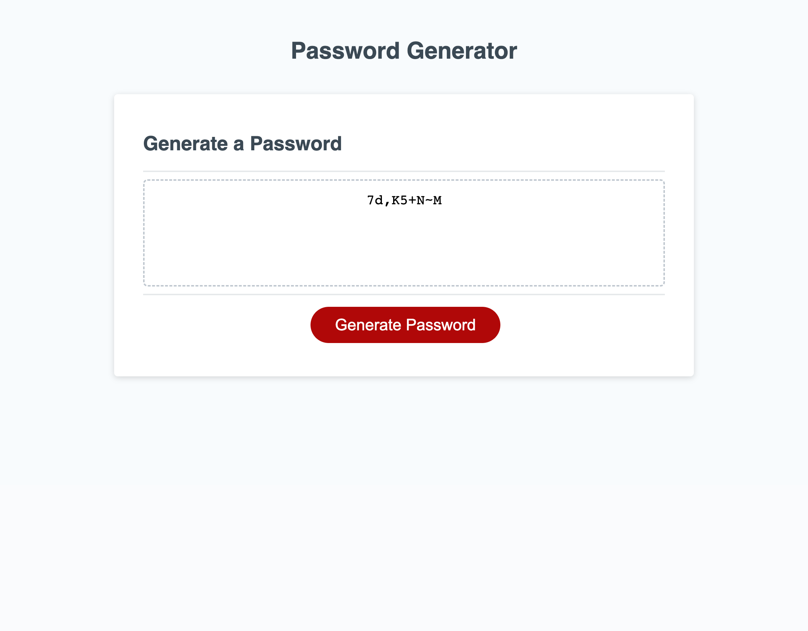

# PasswordGenerator

This webpage is a password Generator. It accepts multiple prompts from the user to randomly generate a password of specific length, including a combination of required characters. 

## Navigation ✈️
All of the content is visble on the screen. The Generate Password button will launch the series of prompts for the user. 

## Application
The Generate Password button asks the user a series of prompts:
    - The required length of the password (only accepts numerical values between 8 -128)
    - A binary question to include lowercase letters
    - A binary question to include uppercase letters
    - A binary question to include numeric characters
    - A binary question to include special characters  
At the end of the questions, a randomly generated password is output into the main page.

### Technologies used
This website was built using HTML, Javascript and CSS.

### Licences
This website uses MIT Licence

### Screenshot

### Link to deployed website
[Website Link](https://riskthatbiscuit.github.io/PasswordGenerator/)